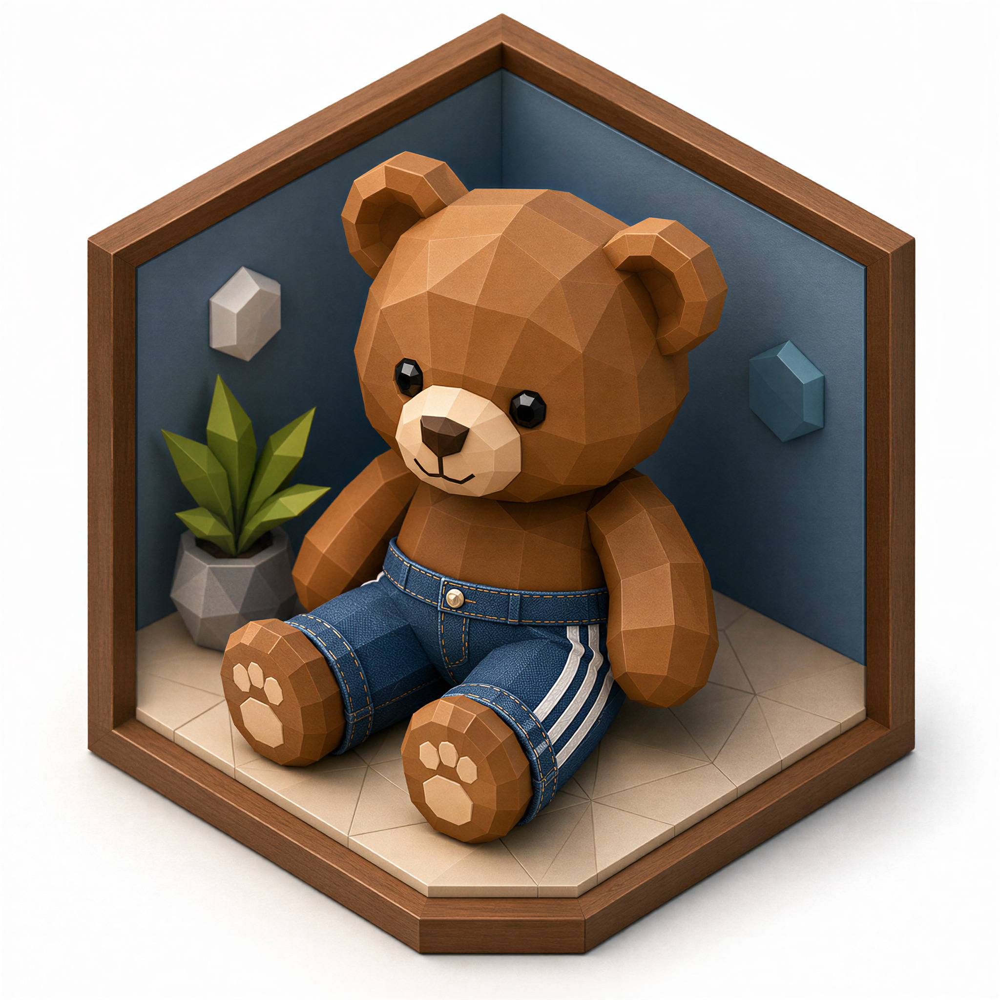

  <a href="./README.md">English</a>
  &nbsp;·&nbsp;
  <strong>한국어</strong>

  

  <h1>[Jason Lee] 𝑭𝒓𝒂𝒈𝑩𝒆𝒂𝒓</h1>

  

    <samp>이것저것 만져 보고 직접 만드는 걸 좋아합니다!</samp>
  

 

## 링크 및 연락처

  
  
  
  
  
  

 

## 소프트웨어 및 하드웨어 스택

<table width="100%">
  <tr>
    <th align="left">일반</th>
  </tr>
  <tr>
    <td>
      
      
      
      
      
    </td>
  </tr>
</table>

<table width="100%">
  <tr>
    <th align="left">언어</th>
  </tr>
  <tr>
    <td>
      
      
      
      
    </td>
  </tr>
</table>

<table width="100%">
  <tr>
    <th align="left">서버 / 인프라 / 네트워크</th>
  </tr>
  <tr>
    <td>
      
      
      
      
      
    </td>
  </tr>
</table>

<table width="100%">
  <tr>
    <th align="left">웹</th>
  </tr>
  <tr>
    <td>
      
      
      
      
    </td>
  </tr>
</table>

<table width="100%">
  <tr>
    <th align="left">AI / 자동화</th>
  </tr>
  <tr>
    <td>
      
      
      
      
    </td>
  </tr>
</table>

<table width="100%">
  <tr>
    <th align="left">3D / PCB / IoT</th>
  </tr>
  <tr>
    <td>
      
      
      
      
      
      
      
      
      
    </td>
  </tr>
</table>

 

## GitHub 아이소캘린더

  <picture>
    <source
      media="(prefers-color-scheme: dark)"
      srcset="./assets/metrics.plugin.isocalendar.fullyear.dark.svg"
    />
    <source
      media="(prefers-color-scheme: light)"
      srcset="./assets/metrics.plugin.isocalendar.fullyear.light.svg"
    />
    
  </picture>

